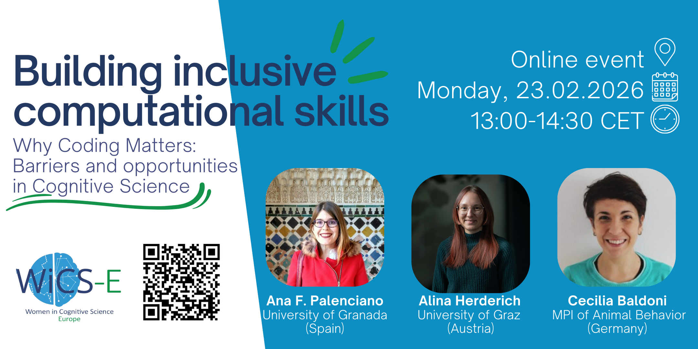

<!-- WiCS Europe Homepage -->

  

# Women in Cognitive Science 
# Widening Inclusivity in Cognitive Science - Europe

[**Women in Cognitive Science (WiCS)**](https://www.womenincogsci.org/) is an umbrella organization dedicated to advancing equity, visibility, and inclusion for all scientists in cognitive science.

Founded in **2001** by **Profs. [Judith Kroll](https://bilingualismmindbrain.com/lab-members/judith-f-kroll/), [Randi Martin](https://randimartin.rice.edu/), and[ Suparna Rajaram](https://rajarammemorylab.com/suparna-rajaram/)**, WiCS has  worked to celebrate the contributions of women, dismantle systemic barriers, and create professional development opportunities. 

Due to the historical underrepresentation of women in academia, WiCS emerged from the collective effort of female scientists who recognized the need to unite in order to enhance visibility and support career development throughout the academic journey. As such, the primary audience for WiCS events includes individuals who identify as women (cisgender, transgender, and gender‑diverse) in cognitive science. However, participation is not exclusive, as we aim to foster collaboration across the entire community and emphasize that all are welcome. 
In **2021**, WiCS broadened its mission to **WiCS+**, recognising its origins and standing also for Widening Inclusivity in Cognitive Science, signaling a stronger commitment to inclusivity for all historically underrepresented groups in cognitive science. This expansion includes promoting **diversity, equity, and inclusion across intersecting identities such as race, ethnicity, gender, ability, and socioeconomic background**. WiCS is now a worldwide network with active chapters in [Canada](https://wicsc.ca/) and Europe, and it continues to grow - expanding its reach, building connections, and shaping a more inclusive future for cognitive science.

Through mentorship, advocacy, and community‑building, WiCS+ empowers a global network of scholars and works toward a more inclusive and equitable field of cognitive science. Central to WiCS+ is the creation of **safe, inclusive spaces free of violence, discrimination, and harassment**, grounded in mutual respect, dignity, and human rights.
To learn how this idea first took shape and matured into a long‑lasting effort supporting gender equity in cognitive science, please read: Martin, R. C., & Rajaram, S. (2024). The founding and growth of women in cognitive science: An enduring legacy of Judith Kroll. The American Journal of Psychology, 137(2), 215–223. [doi](https://doi.org/10.5406/19398298.137.2.12)

## WiCS+ Europe

The **European chapter of WiCS+ (WiCS+E)** was established in **2016** at the International Psychonomics Meeting in **Granada, Spain**, co‑founded by **Drs. Teresa Bajo and Cristina Cacciari**. 

---

## Mission

WiCS+E brings together cognitive scientists across Europe to increase the visibility of women and underrepresented groups, support collaboration and career development, and promote a gender‑aware approach to reducing inequality in science.

You will find us at:

* Biennall meetings of of the European Society for Cognitive Psychology ([**ESCoP**](https://www.escop.eu)): ESCOP provides regular support to WiCS+Europe by including an in‑person meeting and speed‑mentoring session as part of the satellite events in the conference program.
* Other international scientific  conferences such as the International Convention of Psychological Science (**[ICPS](https://www.psychologicalscience.org/icps/about)**), International Symposium on Bilingualism (**[ISB](https://www.bcbl.eu/events/isb15/en/)**), or the Society for Applied Research in Memory and Cognition (**[SARMAC](https://www.sarmac.org)**)
* **[Online events](https://www.eventbrite.it/o/women-in-cognitive-science-europe-wics-e-41025108503)** held at least once a year, with a recurring event every **March** to celebrate **Women’s Month**

Our goals are to:

* Provide resources for professional and research career development
* Foster collaboration and mentoring opportunities
* Create spaces for meaningful connections and open knowledge sharing
* Promote equity, inclusion, and visibility for scholars historically excluded from science

Through mentoring, shared resources, and collective care, we strive to make cognitive science a field where **every voice matters**.

---

## Our Commitments

We are committed to:

* Celebrating the contributions of women and gender‑diverse scholars
* Promoting **intersectional inclusion**
* Providing meaningful support and visibility for scholars historically excluded from academia
* Creating communities rooted in mentorship, intergenerational dialogue, and collective care
* Centering **queer, trans, and non‑binary voices** as essential to the future of science

---

## Contact

We are open to new initiatives, activities and meetings.  
If you’re interested in organizing an event or helping out the current leadership team, please reach out to us.

[👉 **JOIN US**](joinus.md)

* **Email:** [wics.europe@gmail.com](mailto:wics.europe@gmail.com)
* **Facebook:** [https://www.facebook.com/WiCSEurope](https://www.facebook.com/WiCSEurope)
* **Bluesky:** [https://bsky.app/profile/wicseurope.bsky.social](https://bsky.app/profile/wicseurope.bsky.social)
* **LinkedIn:** [https://www.linkedin.com/company/108927366/](https://www.linkedin.com/company/108927366/)

---

## Events
### Upcoming Events

| Event | Details |
|------|---------|
| **Building Inclusive Computational Skills** |   <strong>Online panel</strong> Monday, 23 February 2026 13:00–14:30 CET  As part of International Women’s Month, this panel explores why computational methods matter and how to make them more accessible and inclusive across career stages.  [More information & registration](https://www.eventbrite.co.uk/e/building-inclusive-computational-skills-online-panel-discussion-tickets-1981353031253)|

### Past Events

Information about past WiCS+E events, including panel discussions, seminars, and mentoring
sessions, can be found on our  **[Events page]({{ '/events.html' | relative_url }})**

### ESCOP2025 event 

Information about most recent ESCOP event WiCS+E events can be found  **[here]({{ '/pastevents-summary/ESCOP-2025.html' | relative_url }})**

